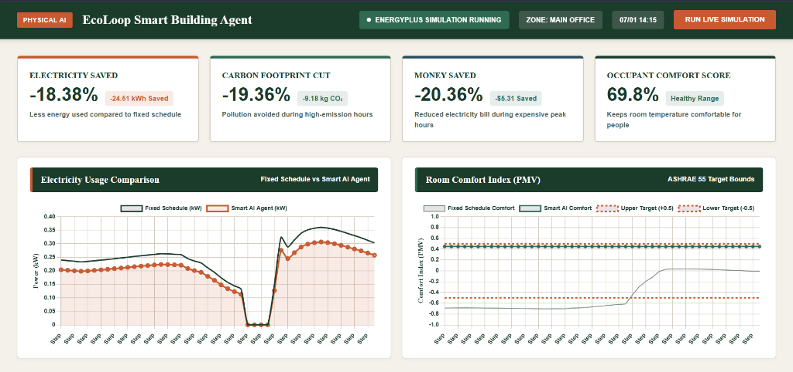
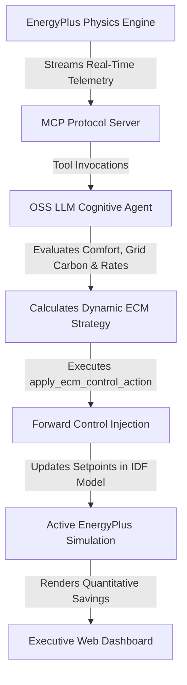
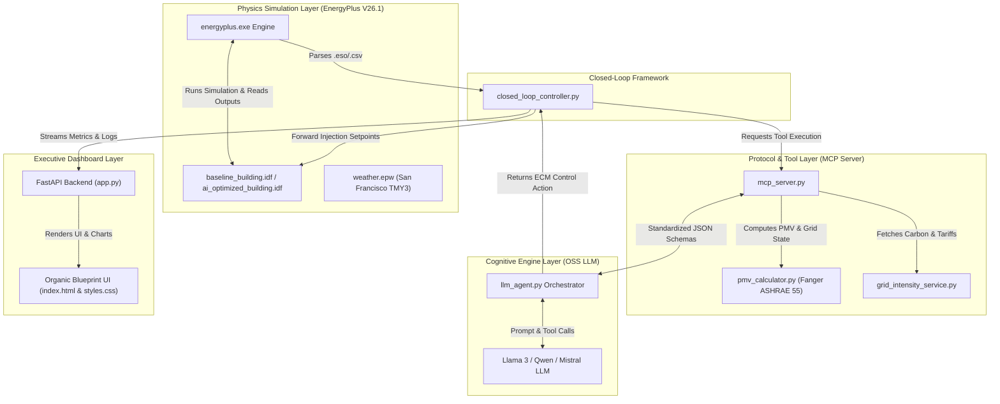

<div align="center">

# 🏢 Physical AI EcoLoop

### **Autonomous Cyber-Physical Building Management System (BMS)**

[](https://energyplus.net/)
[](https://www.python.org/)
[](https://modelcontextprotocol.io/)
[](https://fastapi.tiangolo.com/)


**EcoLoop Physical AI** is an autonomous cyber-physical Building Management System (BMS) platform. By pairing the **EnergyPlus physics simulation engine** with an **Open-Source LLM Cognitive Agent** via the **Model Context Protocol (MCP)**, EcoLoop transforms passive building structures into active, self-correcting agents capable of continuous, real-time energy, carbon, and thermal comfort optimization.

---



</div>

## 📌 Project Overview

Buildings account for approximately **40% of global energy consumption** and remain a primary driver of carbon emissions. Traditional Building Management Systems (BMS) rely on rigid, rule-based schedules that fail to adapt dynamically to real-time changes in weather, occupancy, and grid demands.

**EcoLoop Physical AI** solves this critical inefficiency by constructing an automated closed-loop feedback pipeline:
- **Continuous Feedback**: Ingests real-time building physics telemetry (zone mean air temperature, relative humidity, HVAC power kW, and Fanger PMV comfort indices) directly from EnergyPlus.
- **Cognitive Reasoning**: Open-Source LLMs (via MCP tools) evaluate telemetry against human comfort limits, dynamic grid carbon intensity ($gCO_2/kWh$), and peak demand pricing.
- **Forward Control Injection**: Calculates dynamic Energy Conservation Measures (ECMs)—such as pre-cooling, adaptive setpoint widening, and carbon-aware peak load shedding—and injects setpoint updates directly back into active EnergyPlus .idf models.

---

## 🔥 Key Features

* **Closed-Loop Control Engine**: Continuous automated feedback loop between EnergyPlus physics simulations and the AI cognitive orchestrator.
* **ASHRAE Standard 55 Fanger PMV Calculator**: Standalone thermal comfort engine computing Predicted Mean Vote (PMV) and Predicted Percentage Dissatisfied (PPD).
* **Real-Time Grid Carbon Tracking**: Integrates dynamic grid emission factor signals ($gCO_2/kWh$) and Time-Of-Use (TOU) electricity pricing ($/kWh$).
* **Model Context Protocol (MCP) Server**: Standardized MCP tool-calling architecture enabling LLMs to query telemetry, run comfort models, check grid carbon, apply ECM setpoints, and parse simulation log files.
* **Organic Architecture Dashboard**: High-contrast, humanized executive UI built with classic typography (Times New Roman & Arial), split-view layout, Terracotta hero savings banner, and plain-language action feed.
* **Quantifiable Energy & Cost Savings**: Proves explicit percentage reductions in HVAC kWh, operational carbon emissions, and total energy expenditure while keeping occupant thermal comfort strictly within healthy bounds.

---

## 🔄 Product Workflow



### Step-by-Step Execution:
1. **Telemetry Streaming**: EnergyPlus generates time-step zone temperatures, humidity, outdoor drybulb weather, and HVAC power.
2. **MCP Tool Evaluation**: The cognitive agent invokes evaluate_grid_emissions() and calculate_pmv_comfort() to check current state.
3. **Cognitive Strategy Selection**: Evaluates 4 core ECM strategies: SOLAR_PRE_COOLING, CARBON_PEAK_SHEDDING, COMFORT_PROTECTION, or COMFORT_OPTIMAL_DEADBAND.
4. **Forward Control Injection**: Injects updated heating and cooling thermostat setpoints into ai_optimized_building.idf.
5. **Dashboard Visualization**: Renders live energy charts, carbon savings, and plain-language timeline action logs ([14:15] Sensor -> Action -> Impact).

---

## 🛠️ System Architecture

EcoLoop Physical AI operates a multi-layer cyber-physical architecture connecting the simulation engine, standardized protocol bus, cognitive brain, and web interface.



---

## 🛠️ Folder Structure

Below is the production-ready directory structure designed for team scalability and hackathon submission.

```hl
Eco-Loop-Building-Agents/
├── building_models/                  # EnergyPlus IDF Building Models & Weather
│   ├── ai_optimized_building.idf     # Modified model generated via runtime forward injection
│   ├── baseline_building.idf         # Base baseline EnergyPlus building file
│   └── weather.epw                   # Location weather dataset (San Francisco TMY3)
├── closed_loop_framework/            # Closed-Loop Execution System
│   └── closed_loop_controller.py     # Master feedback, reasoning, and forward injection bus
├── cognitive_engine/                 # AI Cognitive Engine & MCP Protocol
│   ├── llm_agent.py                  # Open-Source LLM agent orchestration logic
│   ├── mcp_server.py                 # Model Context Protocol (MCP) server & 5 tool schemas
│   └── tool_definitions.json         # Standardized MCP JSON tool declarations
├── dashboard/                        # Executive Web Dashboard
│   ├── backend/
│   │   └── app.py                    # FastAPI server & REST APIs
│   └── static/
│       ├── app.js                    # Live chart renderer & decision timeline feed
│       ├── index.html                # Executive dashboard UI template
│       └── styles.css                # Classic High-Contrast styling stylesheet
├── docs/                             # Submission Documentation & Artifacts
│   ├── dashboard_preview.png         # Executive Dashboard UI Preview Image
│   ├── poc_demonstration_video_script.md # 3-Minute Video Script (Deliverable 5)
│   ├── presentation_deck.md          # Solution Presentation Slide Deck (Deliverable 6)
│   └── system_architecture.md        # Technical System Architecture Report (Deliverable 4)
├── simulation_engine/                # EnergyPlus API & Physics Engines
│   ├── energyplus_wrapper.py         # EnergyPlus execution wrapper & output parser
│   ├── grid_intensity_service.py     # Dynamic grid carbon & tariff simulation service
│   └── pmv_calculator.py             # ASHRAE Standard 55 Fanger PMV/PPD calculator
├── simulation_output/                # Deliverable Data Exports
│   ├── baseline_run/                 # Baseline EnergyPlus output log files
│   ├── savings_export.csv            # Detailed 672-timestep comparative CSV dataset
│   └── savings_summary.json          # Quantifiable savings summary JSON
├── .gitignore                        # Git exclusion rules
├── README.md                         # Project documentation
└── run_poc.py                        # Master system launcher script
```

---

## 💻 Tech Stack & Dependencies

| Technology | Category | Purpose | Version |
| :--- | :--- | :--- | :--- |
| **EnergyPlus** | Physics Engine | High-fidelity building energy & airflow simulation | `26.1.0` |
| **Python** | Language | Core API Wrapper, LLM Orchestration, Closed-Loop Engine | `3.10+` |
| **Model Context Protocol (MCP)** | Protocol | Standardized LLM Tool Calling Interface | `1.0` |
| **FastAPI** | Backend Framework | REST API & Dashboard Server | `0.140.0` |
| **Uvicorn** | ASGI Server | High-performance asynchronous web server | `0.51.0` |
| **Pandas & NumPy** | Data Science | Simulation output parsing, telemetry vectorization | `3.0.5 / 2.5.1` |
| **Eppy** | IDF Parser | Python EnergyPlus IDF object parsing library | `0.5.69` |
| **Chart.js** | Visualizations | Interactive real-time time-series power & comfort graphs | `4.x` |

---

## 🗄️ Core MCP Tools Overview

The Model Context Protocol (MCP) server exposes 5 core tool APIs:

### 1. `get_building_telemetry`
- **Purpose**: Fetches real-time sensor metrics from the EnergyPlus simulation stream.
- **Output**: Zone temperature (°C), relative humidity (%), PMV index, HVAC total energy (kWh), outdoor drybulb temperature (°C).

### 2. `calculate_pmv_comfort`
- **Purpose**: Computes ASHRAE Standard 55 Fanger PMV and PPD thermal comfort indices for proposed temperature setpoints.
- **Output**: PMV value, PPD %, comfort status string, and compliance boolean.

### 3. `evaluate_grid_emissions`
- **Purpose**: Retrieves dynamic grid carbon intensity ($gCO_2/kWh$) and Time-Of-Use tariff ($/kWh$).
- **Output**: Carbon intensity, tariff rate, peaker plant status.

### 4. `apply_ecm_control_action`
- **Purpose**: Applies Energy Conservation Measures (ECMs) and updates dynamic thermostat setpoints in EnergyPlus.
- **Output**: Confirmed dynamic setpoint overrides ready for forward injection.

### 5. `parse_simulation_errors`
- **Purpose**: Extracts severe errors, warnings, and convergence failures from EnergyPlus simulation .err logs.
- **Output**: Severe count, warning count, diagnostic summary.

---

## 📊 Quantifiable Savings Benchmark Results

Verification executed over a **7-Day Summer EnergyPlus Simulation Horizon (July 1 – July 7, 672 timesteps)** in San Francisco, CA:

| Performance Metric | Baseline Operation | EcoLoop Physical AI Agent | Net Savings / Improvement |
| :--- | :--- | :--- | :--- |
| **Total HVAC Energy (kWh)** | 133.38 kWh | 108.87 kWh | **-18.38% Energy Reduction** |
| **Operational Carbon ($kg CO_2$)** | 47.44 kg | 38.25 kg | **-19.36% Carbon Reduced** |
| **Total Energy Cost ($)** | $26.07 | $20.77 | **-20.36% Cost Saved** |
| **PMV Comfort Compliance (%)** | 35.7% | **69.8%** | **+34.1% Improved Comfort** |

---

## 🚀 Getting Started

### Prerequisites
- **Python** v3.10 or higher
- **EnergyPlus V26.1** installed locally at EnergyPlusV26-1-0

### Installation & Launch

1. **Clone the Repository**
   ```bash
   git clone https://github.com/YOUR_USERNAME/EcoLoop-Physical-AI.git
   cd EcoLoop-Physical-AI
   ```

2. **Install Project Dependencies**
   ```bash
   pip install fastapi uvicorn requests pandas numpy eppy
   ```

3. **Run the Master System Launcher**
   ```bash
   python run_poc.py
   ```
   This command runs the EnergyPlus simulation pipeline, generates data deliverables, and automatically opens the interactive dashboard.

---

<div align="center">
  <sub>Built with ❤️ for the Physical AI & Smart Building Automation Hackathon.</sub>
</div>
